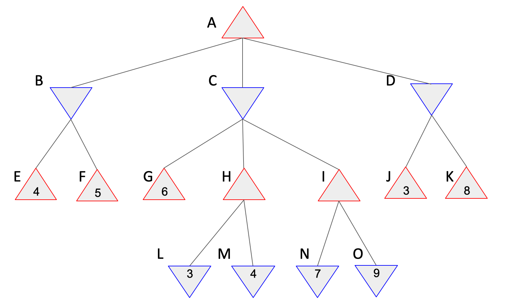

## 8. Breadth-first search (BFS) tree (Chapter 3)
This is not a programming activity. Tracing the [breadth-first search (BFS) algorithm](./bfs.png) for a problem results in a BFS tree. [Here](./bfstree.png) is an example BFS tree. Below is a map of India highlighting some of the international airports in the country. Nick wants to go to Amritsar from Chennai. In PAPER, draw a BFS tree for the graph of airport cities with starting node as Chennai (C).  


## 9. Implement the breadth-first search (BFS) algorithm (Chapter 3)
With the help of the code blocks provided below, implement the BFS algorithm (in Python) to find the shortest path from Sibiu to Bucharest in the following map.

      
   
```Python
'''
Queues in Python:
'''
# Initializing a queue 
queue = []  
# Adding elements to the queue 
queue.append('a') 
queue.append('b') 
queue.append('c') 
# Print
print(queue) 
# Removing elements from the queue 
print("\nElements dequeued from queue") 
print(queue.pop(0)) 
print(queue.pop(0)) 
print(queue) 
```

```
'''
Representing a graph using dictionary (values are lists of neighbors):
'''
graph = {} 
graph['A'] = ['B', 'C']
graph['B'] = ['A', 'D', 'E']
```

## 12. Alpha-beta pruning (Chapter 5)
This is not a programming activity, you will solve it in paper. For the following game tree, (a) show which nodes/sub-tree will be pruned by the Alpha-Beta pruning algorithm, and (b) calculate the minimax values (the output of MAX-VALUE or MIN-VALUE) for the non-leaf nodes. 
 


## 15. Implement BM25 function (Chapter 22)  
The objective in this activity is to search for 'relevant' document/s in a document corpus (database) by implementing the [BM25 scoring function](./bm25.png). Task: A search query “Word1 Word2” is being scored against 40 documents. The number of times the words “Word1” and “Word2” appear in each of the documents is given in the [table](./bm25.csv). Write a Python program to calculate the BM25 score for the query against all the documents and rank the documents by their BM25 score. You will need to compute IDF, DF, TF, N, L, etc. by reading the table. Assume k = 1.2 and b = 0.75. The code block below suggests the structure for your implementation.

* Lectures: [BM25 scoring function](https://www.youtube.com/watch?v=a3sg6MH8m4k)

```python
# Step 1: for loops to calculate IDF for Word1 and Word2
...
# Step 2: for loop to calculate L
...
# Step 3: create a dictionary/list to maintain BM25 for each document
bm25 = {}
# Step 4: for loop to calculate BM25 for each document
for each ...:
 bm25[doci] = ...
# Step 5: display documents sorted by score 
...
```

## 16. Implement PageRank algorithm (Chapter 22)
The objective in this activity is to implement a basic version of the PageRank algorithm - a core algorithm originally developed by Google for ranking pages. [Here](./pagerankalgo.png) is the expression for the original version of the PageRank algorithm. Task: For the network shown below, calculate the PageRank of the pages A, B, and C, and D by writing a Python program to iteratively obtain the final page ranks. Assume that the damping parameter d is 0.7. Please follow the solution structure provided in the code block below.   
* Lectures: [The page-rank algorithm](https://youtu.be/CsvyPNdQAHg).

    

Structure for the solution:
  ```python
  # Step1. Initialize the constants N and d
  # Step2. Assume that all page ranks are 1.0 at the beginning
  prA = 1.0
  ...
  # Step3. In a for/while loop, iteratively update the page ranks of all the pages
  for (many times):
     prA = "expression for prA"
     ...
  # Step4. Print the page ranks
  ```

## 18. Implement convolution operation (Chapter 24)
In this activity you will implement the convolution operation. Your implementation will detect edges in an image. You are required to implement you own convolution function and NOT use existing libraries. Please use the [my-cat.csv](./my-cat.csv) as your input. Your task is to complete the `convolution2D()` function in the code below. Hint: You will need to multiply each input pixel (3x3 neighbor grid) of the input 2D array `image2D` with the input filter `kernel3x3` to obtain the output 2D array `convolved2D`. Note: If you use existing libraries such as `scipy.signal.convolve2d` you will not receive any points for your submission.  
* Articles: [First four paragraphs under the section "2D Convolutions: The Operation"](https://towardsdatascience.com/intuitively-understanding-convolutions-for-deep-learning-1f6f42faee1)
* Lectures: [Convolution operation](https://www.youtube.com/watch?v=mjh5NIn1yHk)
 
```python
import seaborn as sns
import matplotlib.pyplot as plt
import numpy as np

def convolution2D(image2D, kernel3x3):
  convolved2D = np.zeros((len(image2D)-2, len(image2D)-2))
  # ToDo: Write your code here...

  return convolved2D

image2D = np.loadtxt('my-cat.csv', delimiter=',')
sns.heatmap(image2D, cmap='gray')
plt.title('Original image - Size = ' + str(image2D.shape))
plt.show()

edge_detect_filter_3x3 = np.array([[-1, -1, -1], [-1, 8, -1], [-1, -1, -1]])

for i in range(2):
  convolved_image = convolution2D(image2D, edge_detect_filter_3x3)
  sns.heatmap(convolved_image, cmap='gray')
  plt.title('Convolution iteration ' + str(i) + ' - Size = ' + str(convolved_image.shape))
  plt.show()
  image2D = convolved_image
```

Expected output:
  
